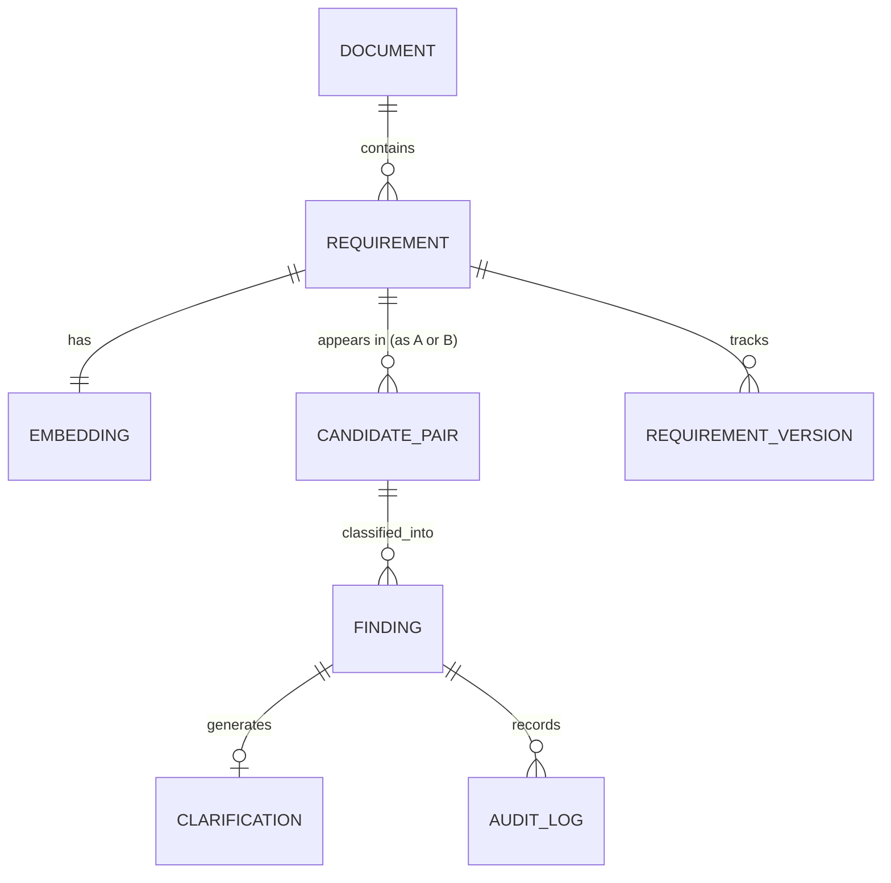

# Database Documentation

**ER Diagram, Table Definitions, and Data Dictionary**

| | |
|---|---|
| **Engine** | PostgreSQL + pgvector extension |
| **Status** | Planned schema — `alembic/` migrations not yet created |

---

## 1. ER Diagram

## 2. Tables (7)

### 2.1 documents

| Column | Type | Notes |
|---|---|---|
| id | UUID (PK) | Primary key |
| filename | varchar | Original uploaded filename |
| format | varchar | pdf / docx / txt / reqif — FR-01 |
| status | varchar | queued / processing / done / failed — FR-02, US-03 |
| workspace_id | UUID (FK) | Access scoping — FR-38 |
| uploaded_by | UUID (FK -> users) | Provenance — FR-05 |
| uploaded_at | timestamp | |

### 2.2 requirements

| Column | Type | Notes |
|---|---|---|
| id | UUID (PK) | |
| document_id | UUID (FK) | |
| source_req_id | varchar, nullable | Preserves original REQ-ID if present — FR-04, DR-03 |
| body | text | Extracted requirement statement |
| stakeholder_group | varchar, nullable | Provenance — FR-05, DR-11 |
| is_protected | boolean, default false | Compliance-critical flag — FR-21, DR-05 |
| current_version | int | FK target into requirement_versions |

### 2.3 requirement_versions

| Column | Type | Notes |
|---|---|---|
| id | UUID (PK) | |
| requirement_id | UUID (FK) | |
| version_no | int | |
| body_snapshot | text | Prior text at this version — FR-26, DR-08 |
| changed_by | UUID (FK -> users) | |
| changed_at | timestamp | |

### 2.4 embeddings

| Column | Type | Notes |
|---|---|---|
| id | UUID (PK) | |
| requirement_id | UUID (FK, unique) | |
| vector | vector(384) | all-MiniLM-L6-v2 output — FR-07, FR-08 |
| model_version | varchar | For re-embedding on model upgrade |

### 2.5 candidate_pairs

| Column | Type | Notes |
|---|---|---|
| id | UUID (PK) | |
| requirement_a_id | UUID (FK) | |
| requirement_b_id | UUID (FK) | |
| similarity_score | float | Above configurable threshold — FR-09, FR-10 |
| generated_at | timestamp | |

### 2.6 findings

| Column | Type | Notes |
|---|---|---|
| id | UUID (PK) | |
| candidate_pair_id | UUID (FK, nullable) | Null for single-requirement findings (e.g., Incomplete) |
| category | enum | Conflicting / Duplicate / Ambiguous / Incomplete / Dependent |
| confidence | float (0-1) | FR-13 |
| rationale | text | Natural-language explanation — FR-14 |
| status | varchar | flagged / confirmed / dismissed / merged / reclassified — FR-18 |
| original_ai_output | jsonb | Preserved even after human correction — FR-20 |
| severity | varchar, nullable | US-08 |

### 2.7 audit_log

| Column | Type | Notes |
|---|---|---|
| id | UUID (PK) | |
| finding_id | UUID (FK, nullable) | |
| actor_id | UUID (FK -> users) | |
| action | varchar | e.g. viewed_protected, dismissed, merged — FR-19, FR-36, NFR-13 |
| at | timestamp | |

*An 8th planned table, `clarifications` (finding_id, question, resolution — FR-22/FR-23), is intentionally kept 1:1 with findings and is described inline in the class diagram in `diagrams.md` rather than repeated here.*

## 3. Indexing Notes

- `embeddings.vector` needs an IVFFlat or HNSW pgvector index for similarity search to stay within the NFR-01/NFR-02 performance targets at scale.
- `candidate_pairs` should be indexed on `(requirement_a_id, requirement_b_id)` to support fast lookups from the graph view (FR-29).
- `audit_log` should be append-only with no update/delete permission at the application layer, consistent with FR-36 (exportable, complete audit trail).
