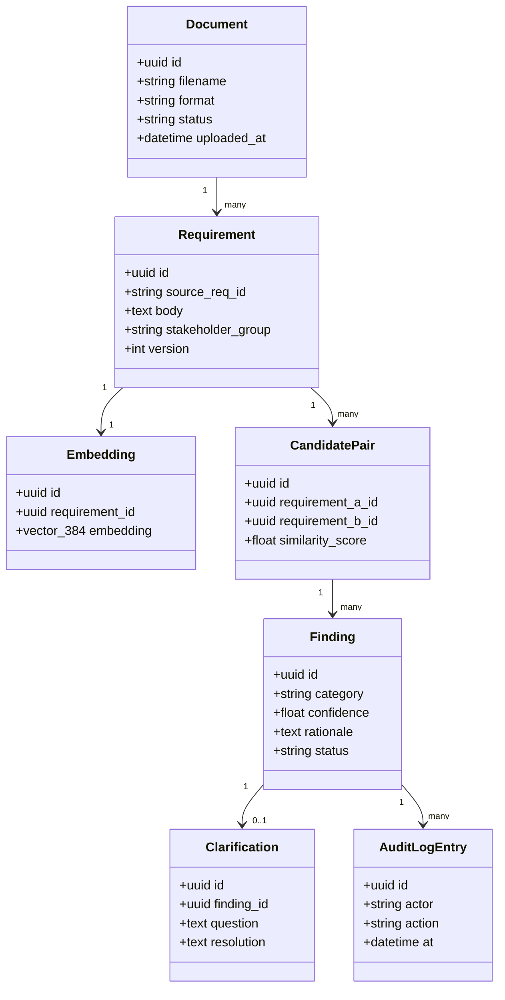
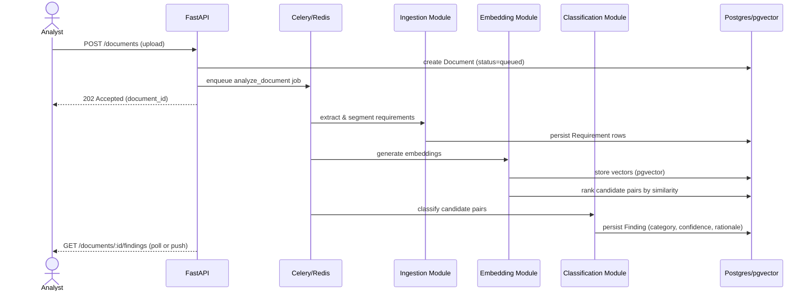
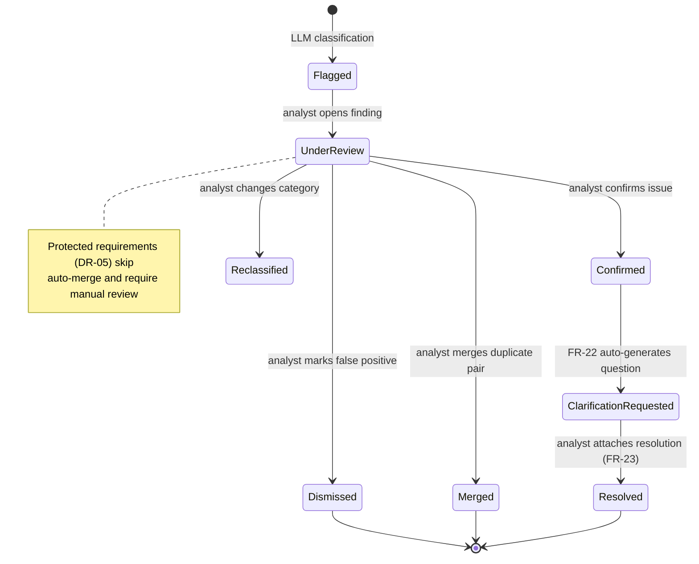
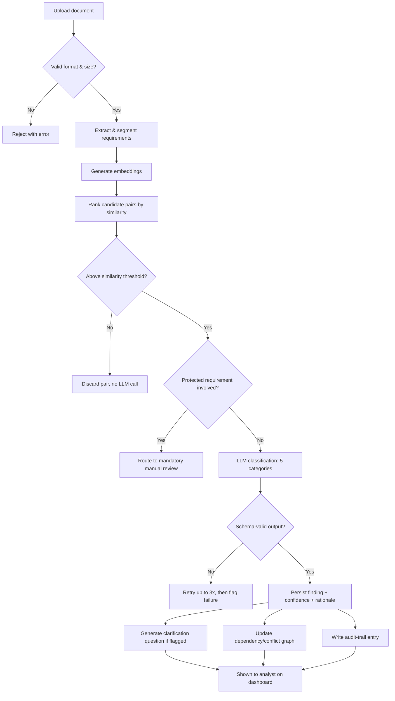

# UML Diagrams

**Class, Sequence, State & Activity Diagrams (Design Stage)**

> Status: Design diagrams — no code exists yet; these describe planned structure.
> These render natively as diagrams in GitHub's markdown viewer (Mermaid fenced code blocks) — no extra tooling needed.

A hand-drawn activity diagram for the core pipeline workflow was submitted with Lab 6 as a separate photograph. Diagram 4 below is a typed Mermaid re-expression of that same workflow for repo documentation purposes.

---

## 1. Class Diagram — Core Data Model

## 2. Sequence Diagram — Upload to Classification

## 3. State Diagram — Finding Lifecycle

## 4. Activity Diagram — Conflict-Detection Pipeline

Typed re-expression of the Lab 6 hand-drawn diagram: upload → validate → extract/segment → embed → rank candidates → threshold check → protected-requirement check → LLM classify → validate output/retry → persist finding → clarification/graph/audit trail → shown to analyst.

